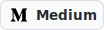

  
  
  

> Bioinformatics · Machine Learning · Biomedical Data

- 👋 Hi, I’m Adina
- 🎓 MSc Bioinformatics Student @ Freie Universität Berlin 
- 🧠 Interested in ML x Bioinformatics  
- 📝 Open to research collaborations  
- 📫 Reach me:  
  • adinanadeem [at] gmail [dot] com  
  • adina [dot] nadeem [at] fu-berlin [dot] de

